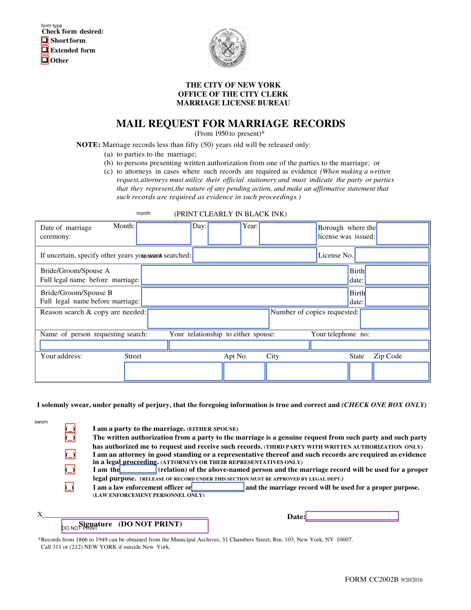

# cc2002b

[](https://github.com/olanotolu/meetneptune-cc2002b/actions/workflows/test.yml)

json in → flat nyc marriage-record request out. one form. proved.

source packet: [`00_packet/neptune-takehome-form-fill-packet (7).pdf`](00_packet/neptune-takehome-form-fill-packet%20(7).pdf)

```text
packet → approved spec → validate → black ink → prove
```


---

## the problem

customers hand us structured facts. the city clerk wants those facts on a
flat pdf with no fillable fields, in black ink, inside boxes laid out in
2016. page 2 of the packet is form cc2002b — no acroform, boxes are ink
targets, not `set_value` fields.


---

## approach

**offline, once:** the blank filing surface (`00_packet/cc2002b_blank.pdf`)
is a structural extract of packet page 2 (`pikepdf`, not a raster —
`extract_blank()`, `cc2002b.py` §9, only imported when `--extract-blank`
actually runs). its field coordinates were measured once against the
blank's own drawn geometry, reviewed against an overlay image, and frozen
into [`cc2002b.spec.json`](cc2002b.spec.json) — plain data: a 32-field
coordinate table (30 fillable + 2 protected), the approved blank's sha-256,
page geometry, anchors, and checkbox name maps.
[`tools/inspect_form.py`](tools/inspect_form.py) is the dev-only script
that helped propose those coordinates (word/glyph dump + overlay render);
it's never imported by the runtime. [`evidence/`](evidence/) is the paper
trail — the approved overlay and the per-field derivation notes.




blue = text · red = checkbox · purple dashed = machine must never ink

**at runtime:** one file, `cc2002b.py`. json in → strict schema → business
validation → fingerprint gate → black ink → reopen and prove.

```text
JSON → Application (pydantic) → validate() → fingerprint gate
    → fill_final() → check_correctness() → proof receipt
```

no fastapi · no langchain · no ocr · no live model on the final filing.

---

## agentic form compilation (offline only)

`tools/compile_form.py` is the offline compiler. It proposes a candidate field
map for a blank PDF using a vision model + extracted word geometry, renders an
overlay for human review, and can run the same deterministic fill/check pipeline
against the candidate.

```bash
OPENAI_API_KEY=... uv run tools/compile_form.py 00_packet/cc2002b_blank.pdf \
    --output /tmp/candidate_spec.json \
    --overlay /tmp/candidate_overlay.png \
    --payload samples/01_party_short.json
```

The candidate is **never** the approved `cc2002b.spec.json`. A human reviews
the overlay and the auto-verify report, then freezes the approved spec. The
hot path never calls a model.

For CC2002B specifically, the geometry path (`tools/inspect_form.py`) is still
the primary source of truth. The form already contains real word/glyph
coordinates; a vision model is ~460× slower and does not improve accuracy on
a document that already has structure. The agentic compiler exists for the
next form that is a pure scan.

## input shape

nested, strict, one representation per fact —
[`samples/01_party_short.json`](samples/01_party_short.json):

```json
{
  "certificate_type": "short",
  "marriage": {"date": "2025-05-30", "borough": "Manhattan", "license_no": "..."},
  "spouse_a": {"name": "Sol Lee", "birth_date": "1991-07-29"},
  "spouse_b": {"name": "...", "birth_date": "..."},
  "authorization": {"kind": "party"}
}
```

`authorization` is a discriminated union over the five sworn-statement
kinds (`party` / `written_authorization` / `attorney` / `relation` /
`law_enforcement`); `relation` and `law_enforcement` each require their own
extra field (`relation`, `agency_or_title`). Every model uses
`extra="forbid"`. Together this makes "exactly one sworn statement, with
the right inline text and nothing leaked onto the wrong one" a schema
guarantee, not ~20 lines of conditional validation — the schema simply
can't construct the bad shape.

dates are native `date` fields, ISO 8601 only — `"May 30, 2025"` and
`"05/30/2025"` are both schema rejections, same as the CTO's original
"strict month, no names or numeric strings" rule, just generalized to the
whole date instead of one field.

a malformed payload fails at the schema layer (`pydantic.ValidationError`,
before `validate()` ever runs); a validly-shaped payload that breaks a
business rule fails inside `validate()`. Which layer catches what is
deliberate, not incidental — see `tests/test_cc2002b.py`'s
`assertRejectsAtSchema` / `assertRejectsAtValidate` split.

---

## validation policy

- marriage year &lt; 1950 → municipal archives, not city clerk
- inkable only — latin-1 stays on base-14 helvetica; broader names
  (Nguyễn, Łukasz, Παπαδόπουλος, Дмитрий) fall back to an embedded Unicode
  font (`fonts/DejaVuSans.ttf`); anything neither font can render (CJK,
  Arabic, emoji) fails loud with the exact character and codepoint
- text must fit the measured cell — greedy word-wrap, largest font that
  fits, wrapping to more lines only if the cell's own height allows it. The
  relation/law-enforcement inline blanks (`auth_relation`,
  `auth_other_agency`) are ~47pt wide by the form's own design, so they get
  a lower floor (down to 6pt) than every other field's 8pt minimum
- `certificate_type: other` → no price on schedule → refuse
- relation/law_enforcement authorization on a record under 50 years old →
  **note**, not a rejection. the form's own parentheticals describe
  adjudication paths (legal dept / law enforcement), not a ban — fill and
  flag for review, don't invent a refusal the form doesn't ask for

---

## fee decision

page 2 quotes two different prices for the same extended-form purchase
($15/$10 in one paragraph, $35/$30 in another) with no language reconciling
them. Billed at the type-specific rate ($35/$30) — the general paragraph's
own closing line ("if you do not specify the form you desire you will be
sent a short form") only makes sense if that's the *default form's* price,
not a universal one. Every extended-form proof receipt writes an
`AMBIGUOUS FEE` note with the reasoning and the dollar amount at stake if
the other reading is correct — never resolved silently.

---

## correctness

most of the assessment weight lives here. reopen the pdf; don't trust
process memory.

| layer | what | catches |
|---|---|---|
| semantic (mupdf) | added words equal expected; checkboxes cross | wrong text, unmarked/extra checkbox |
| raster (mupdf) | pixel diff vs. blank: darkness, color, drawn-shape overlap | stray ink, colored ink, paint-over |
| raster (**pdfium**, independent renderer) | same darkness/stray-ink check, different engine | anything layer 2 got wrong about its own rendering |

adversarial tests mutate a good pdf (signature scribble, second checkbox,
white cover, colored ink dark enough to look legitimate) and assert the
**named** check fails — including one proving the independent renderer
catches a signature tamper on its own
(`test_second_renderer_independently_catches_signature_tamper`), and one
proving the *color* check catches something the independent renderer's
darkness-only check can't (`test_colored_ink_evades_pdfium_but_not_mupdf`).

Every fill writes one `*.proof.json`: template/input/output hashes, fee,
notes, and a per-check pass/fail breakdown — one report, not a proof file
plus a separate fees file duplicating part of it.

---

## sample outputs (committed)

| sample | path | exercises | fee |
|---|---|---|---:|
| party / short | [`outputs/01_party_short.pdf`](outputs/01_party_short.pdf) | `kind="party"`, empty inlines | $15 |
| relation / extended | [`outputs/02_relation_extended.pdf`](outputs/02_relation_extended.pdf) | `kind="relation"`, multi-year, fee note | $67 |
| law enforcement | [`outputs/03_law_enforcement.pdf`](outputs/03_law_enforcement.pdf) | `kind="law_enforcement"`, under-50 note | $15 |


checkbox = a real crossed X, not a tick — and the signature line stays empty:


blank vs. filled, same crop:


---

## run

```bash
uv run cc2002b.py samples/01_party_short.json outputs/01_party_short.pdf
uv run cc2002b.py --check outputs/01_party_short.pdf samples/01_party_short.json
uv run --with-requirements requirements.txt python -m unittest discover -s tests -v
```

or, manual venv (pin the interpreter — `pymupdf==1.26.6` has no published
wheel for Python 3.13/3.14 yet, and a stock recent macOS install can
default `python3` there):

```bash
python3.12 -m venv .venv && source .venv/bin/activate
pip install -r requirements.txt
python cc2002b.py samples/01_party_short.json outputs/01_party_short.pdf
python -m unittest discover -s tests -v
```

```text
pymupdf==1.26.6    hot path + verify
pypdfium2==5.9.0   independent re-render for verify
pydantic==2.11.9   strict intake schema
pikepdf==8.7.1     --extract-blank only (lazy-imported; not a fill-time dependency)
```

`make test` / `make fill` / `make check` are shortcuts once a venv is
active. `make check` verifies the three *committed* sample PDFs (depends
on `test`, not `fill`) — the check a reviewer running this top-to-bottom
actually wants: does what's in the repo hold up, not does it regenerate.

---

## cli, not http — and why

the brief leaves the transport open. this ships as a cli:

- the task is a **pure function** — json in, pdf + proof receipt out. no
  session, no auth, no persistence (explicitly out of scope). an http
  server adds a process to keep alive and a port to secure for zero
  behavioral benefit here.
- the fingerprint gate and validation state machine are the product, not
  the transport — `validate()`, `fill_final()`, `check_correctness()` are
  already transport-agnostic. a fastapi route wrapping `fill_final` is a
  thin, mechanical addition whenever a service boundary actually exists.
- a cli composes with how this actually gets used: batch jobs, cron, a
  human running `--check` against a stack of intake json before anything
  gets mailed.

---

## layout of `cc2002b.py`

| § | job |
|---|---|
| 0 | paths, constants, shared helpers |
| 1 | spec loader, fingerprint gate, Pydantic schema (`Application`), `form_values()` adapter |
| 4–5 | validate + fee |
| 6–7 | fill + proof receipt |
| 8 | semantic + raster (mupdf) + independent raster (pdfium) checker |
| 9 | extract-blank (pikepdf, lazy-imported) |
| 10 | cli |

---

## two more weeks

- Turn the offline compiler into a multi-proposer loop (geometry + vision,
  graded by the same checker, human activates)
- CJK/Arabic/RTL name support (shaping + bidi, a different problem than font
  coverage)
- property/mutation fuzz at scale
- resolve `other` pricing with 311
- http wrapper around `fill_final`/`check_correctness` if a second consumer
  needs it

A prior revision of this engine carried a live geometry-re-derivation
command and a dynamic-import module split, both traded away for the
smaller design described above — what changed and why is in the
presentation, not this file. `evidence/NOTES.md` has the field-derivation
detail if a form revision ever needs it back.
