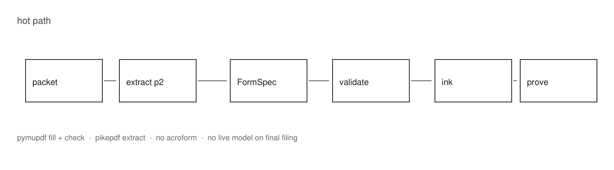
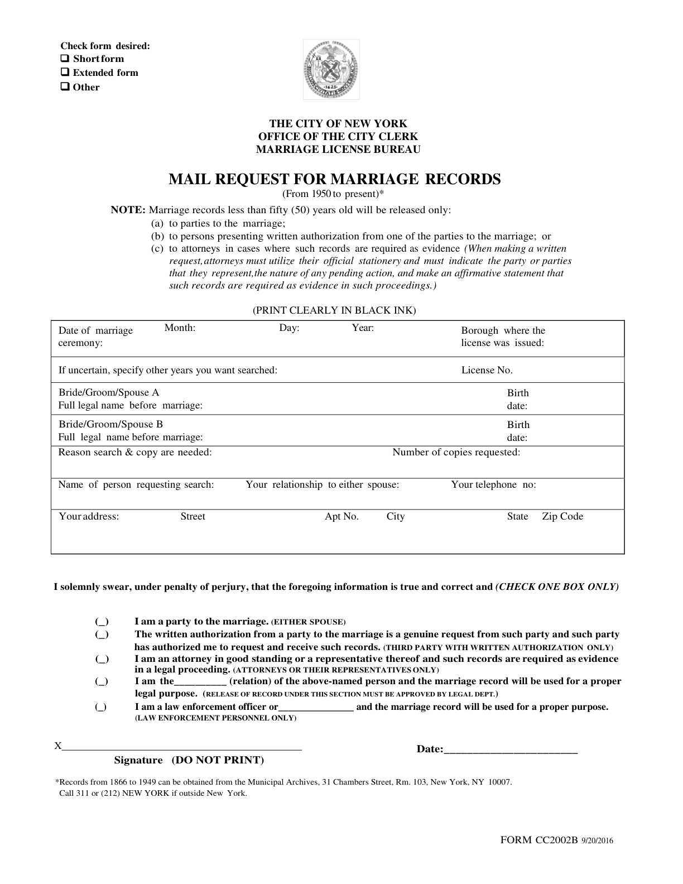
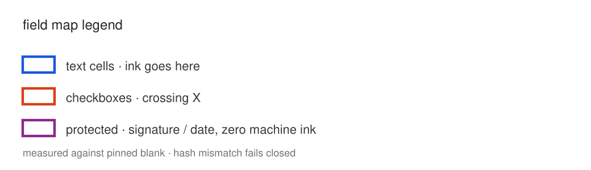
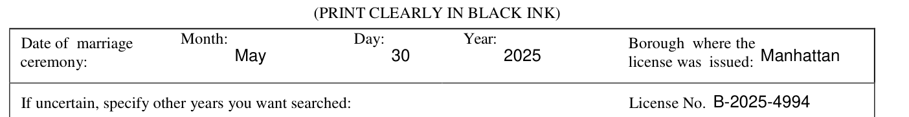
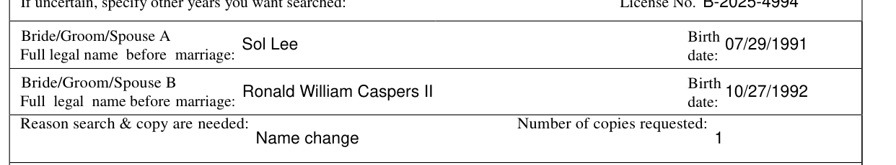
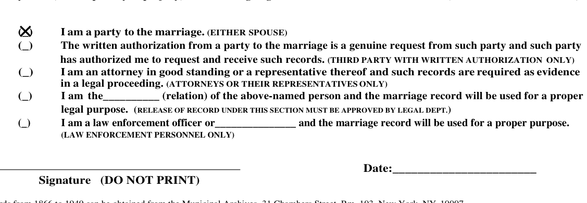
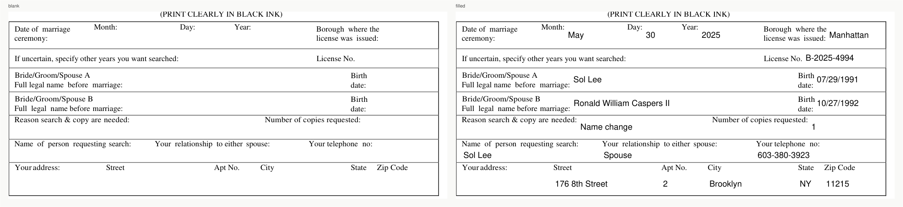
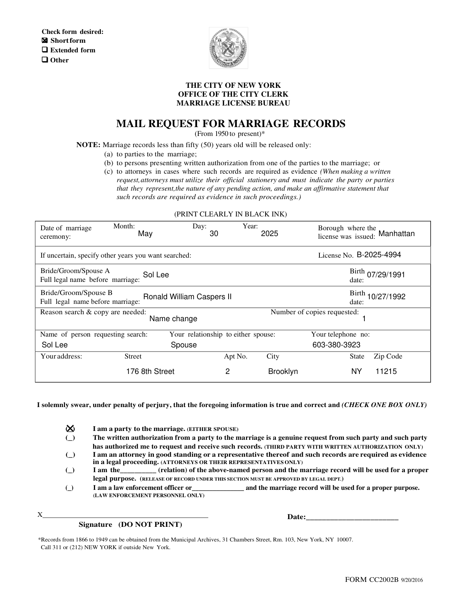

# cc2002b

json in → flat nyc marriage-record request out. one form. proved.

source packet: [`neptune-takehome-form-fill-packet (7).pdf`](neptune-takehome-form-fill-packet%20(7).pdf)

```text
packet → extract p2 → FormSpec → validate → black ink → prove
```



---

## step 0 — the packet

three pages. only one is a filing surface.

| p1 | p2 | p3 |
|---|---|---|
| assignment | **form cc2002b** | fees + instructions |


no acroform on p2. boxes are ink targets, not fields you can `set_value` on.

---

## step 1 — split page 2 only

**tool:** `pikepdf` (libqpdf) — structural object-graph rewrite, not a raster.

```bash
python cc2002b.py --extract-blank \
  "neptune-takehome-form-fill-packet (7).pdf" \
  cc2002b_blank.pdf
```

output is one letter page (`612×792`), committed as `cc2002b_blank.pdf`.

sha-256 (must match `FormSpec` or fill refuses):

```text
f192ef937026ac99220d3f8816aa1b056dce5c32e6dc67c990e7dec6a309025f
```



---

## step 2 — measure the boxes (FormSpec)

**tool:** `pymupdf` word/glyph geometry on the blank.

how rects were derived (not eyeballed once and forgotten):

1. **checkboxes** → glyph bboxes (wingdings at top; ascii `(_)` at bottom — two families)
2. **inline blanks** (relation / le agency) → end of underscore run
3. **table cells** → row bands + label edges (almost no vertical rules)
4. **signature / signature-date** → protected: `fill=False`

compiled into a versioned `FormSpec` keyed by blank hash. unknown hash → **fail closed**. no stretching old coords onto a new city form.




blue = text · red = checkbox · purple dashed = machine must never ink

---

## step 3 — intake (strict month)

json payload. aliases allowed (`spouse_a_name` → form field, etc.).

**month (cto):** json **integer** `1`–`12` only.  
`"May"`, `"5"`, abbreviations → validation error, **no pdf**.  
print side still draws english name from that int (`5` → `May`).

sample (sol lee — the intake path you care about):

[`samples/01_party_short.json`](samples/01_party_short.json)

---

## step 4 — validate before ink

state machine. rejects what a clerk should never receive:

- year &lt; 1950 → municipal archives, not city clerk  
- not exactly one form type / one sworn box  
- relation / le inline text only when auth is 4 / 5  
- latin-1 only (base-14 helvetica; no silent `·` substitution)  
- text must fit the measured cell  
- `form_type: other` → no price on schedule → refuse  

**50-year + auth 4/5:** note, do not invent a ban. form parentheticals are adjudication paths (legal / le). fill + review note.

**fee:** short `$15/$10`, extended `$35/$30`, search years as on p3.  
schedule contradicts itself — we bill type-specific and write the ambiguity into the proof receipt. never silent.

---

## step 5 — put black ink on paper

**tool:** `pymupdf` only on the hot path.

- open blank → assert fingerprint  
- largest of `{10,9,8}pt` that fits  
- pure black rgb  
- checkboxes = two crossing strokes (real X, not parallel ticks)  
- **signature + signature date empty** (do not print)








blank vs filled (same crop):



---

## step 6 — prove the visible artifact

most of the assessment weight lives here. reopen the pdf; do not trust process memory.

| layer | what |
|---|---|
| a · semantic (mupdf) | added words **equal** expected; checkboxes must **cross** |
| b · raster @ 150dpi (mupdf) | every dirty pixel must fall inside an approved rect |
| c · raster @ 150dpi (**pdfium**) | independent re-render, independent verdict — mupdf never grades its own ink alone |
| reject | stray ink · white erase · color · pale ink · paint-over · signature ink · extra page |

adversarial tests mutate a good pdf (signature scribble, second auth box, white cover) and assert the **named** check fails — including a dedicated test that layer c catches the signature tamper on its own, with a wholly different rasterizer (`tests/test_cc2002b.py::test_second_renderer_independently_catches_signature_tamper`).

layer c is deliberately narrow: it re-derives only "no ink outside approved rects" and "every populated field is dark, every empty one isn't" from raw pdfium pixels. It does not re-implement checkbox crossing-geometry (that's a vector check, not a raster one) — its job is to catch the exact failure mode layer b's own rendering bugs could hide, not to duplicate layer a.

---

## step 7 — evidence (committed)

| sample | path | exercises | fee |
|---|---|---|---:|
| party / short | [`outputs/01_party_short.pdf`](outputs/01_party_short.pdf) | auth 1, empty inlines | $15 |
| relation / extended | [`outputs/02_relation_extended.pdf`](outputs/02_relation_extended.pdf) | auth 4, multi-year, fee note | $67 |
| law enforcement | [`outputs/03_law_enforcement.pdf`](outputs/03_law_enforcement.pdf) | auth 5, under-50 note | $15 |

each fill also writes `*.proof.json` (hashes, fee, check counts) and `*.fees.json`.



---

## run

```bash
python3 -m venv .venv && source .venv/bin/activate
pip install -r requirements.txt

python cc2002b.py samples/01_party_short.json outputs/01_party_short.pdf
python cc2002b.py --check outputs/01_party_short.pdf samples/01_party_short.json
python -m unittest discover -s tests -v
```

or: `uv run cc2002b.py samples/01_party_short.json outputs/01_party_short.pdf`  
(deps pinned in pep 723 header + `requirements.txt` — same pins)

```text
pymupdf==1.26.6    hot path + verify (layers a/b)
pikepdf==8.7.1     structural page extract only
pypdfium2==5.9.0   independent re-render for verify (layer c)
```

no fastapi · no langchain · no ocr · no live model on the final filing.

---

## cli, not http — and why

the brief leaves the transport open ("your call — justify it"). this ships as
a cli on purpose:

- the task is a **pure function** — json payload in, pdf + proof receipt out.
  no session, no auth, no persistence (all explicitly out of scope). wrapping
  that in an http server adds a process to keep alive and a port to secure
  for zero behavioral benefit at this stage.
- the **fingerprint gate and validation state machine are the product**, not
  the transport. `validate()`, `fill_final()`, and `check_correctness()` are
  already transport-agnostic — a five-line fastapi route (`payload =
  request.json(); return fill_final(payload, tmp)`) is a thin, mechanical
  wrapper whenever a service boundary is actually needed (batch intake queue,
  a UI, a second form).
- a cli composes directly with how a filing engine like this actually gets
  used first: batch jobs, cron, a human running `--check` against a stack of
  intake json before anything gets mailed. that's the operational reality of
  "mail request for marriage records," not a live request/response UI.

if the next step is a service, the seam is already there — `main()` is the
only http-shaped code in the file; everything above section 10 doesn't know
the cli exists.

---

## layout of `cc2002b.py`

read top → bottom:

| § | job |
|---|---|
| 1 | FormSpec + fingerprint |
| 2–3 | normalize + fail-closed gate |
| 4–5 | validate + fee |
| 6–7 | fill + proof receipt |
| 8 | semantic + raster (mupdf) + independent raster (pdfium) checker |
| 9–10 | extract-blank + cli |

---

## two more weeks (not built)

unicode font embed · `measure` command for the next revision · property/mutation fuzz at scale · resolve `other` pricing with 311 · http wrapper around `fill_final`/`check_correctness` if a second consumer needs it (see [cli, not http — and why](#cli-not-http--and-why))

~~second renderer (pdfium) so mupdf does not grade itself alone~~ — built: layer c in step 6.
